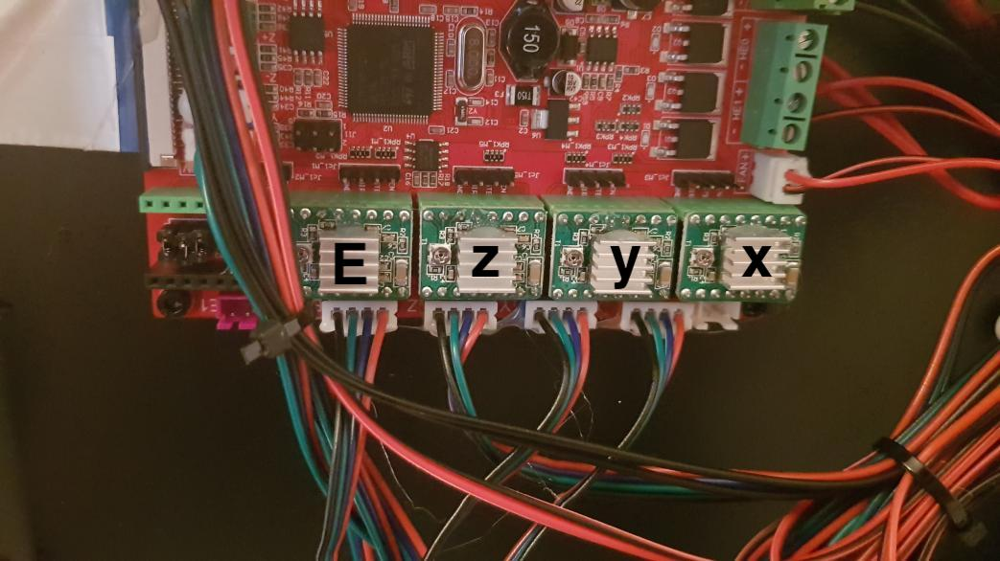

# Sostituzione Drivers con TMC2209

Per la sostituzione di driver si consiglia l'utilizzo di un giravite ceramico, oppure la stampa di [questo](stls/Cacciavite vref.stl)

Per una guida dettagliata su come sostituire i driver, guardate [QUI](https://fbghostita.miraheze.org/wiki/Upgrade_a_tmc2209).

## Impostare la VREF

      
    

Personalmente non ho trovato problemi nell'impostare la VREF ai seguenti valori:

- X Y Z = 0.90
- E = 0.96

