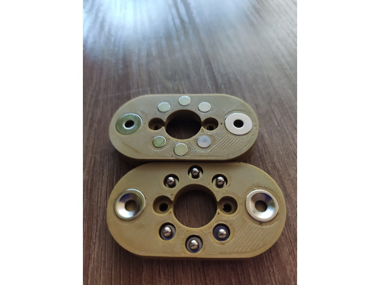
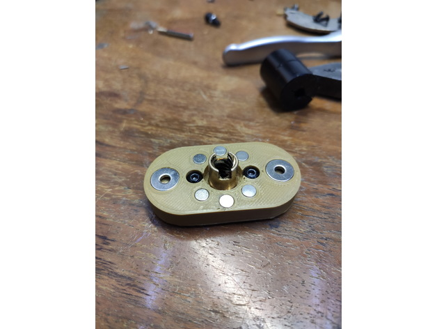
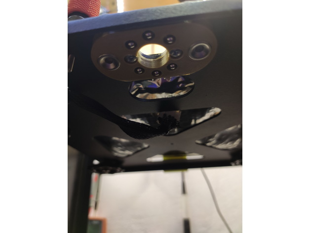
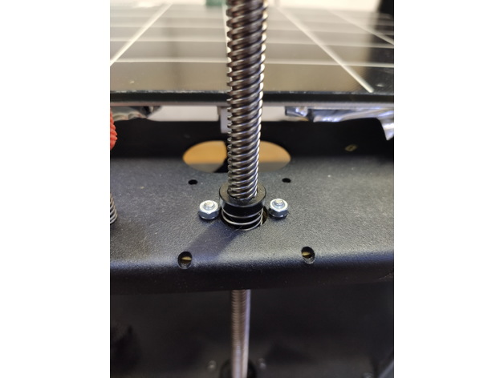
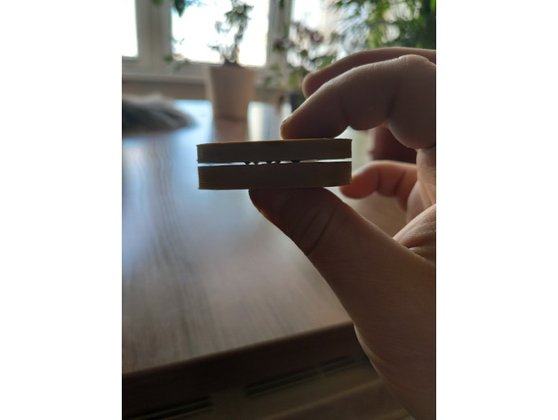

# [Z axis upgrade](https://www.thingiverse.com/thing:4756659)

Tutti hanno visto in dettaglio le distorsioni ritmiche. Sorgono per vari motivi. Spesso sono causati da:
-  asse Z lento
-  disallineamento degli alberi dell'asse Z e della vite di alimentazione dell'asse Z.
-  Ciò può accadere anche a causa di un accoppiamento installato in modo errato che collega l'albero motore e la vite Z.
-  o la curvatura della vite stessa.
-  Anche un dado della vite di alimentazione errato o storto può influire sulla distorsione ritmica.

Per risolvere questo problema, è stata inventata una frizione magnetica, che elimina l'effetto oscillante.
Oltre all'accoppiamento magnetico, nella parte superiore è stato ideato un supporto per albero per ridurre il raggio entro il quale "galleggia" l'estremità della vite ed evitare flessioni eccessive. 

[Questo video mostra il perché effettuare una modifica del genere](https://youtu.be/mqSQhwqSzvg).

## Necessario per installazione

Per assemblare la mod avrai bisogno delle seguenti parti:
- Magneti:
    - [5x2mm - 12 pezzi](https://a.aliexpress.com/_mt1OsOV)
    - [Sfera da 3 mm - 6 pezzi](https://a.aliexpress.com/_mt1Kk5T)
    - [10x3mm - 4 pezzi](https://a.aliexpress.com/_mLvXlsl)

- Viti:
    - m3x10 - 2 pezzi
    - m3x5 - 2 pezzi

- per il supporto della vite Z avrai bisogno di:
    - [Cuscinetto 628 - pezzo](https://a.aliexpress.com/_mPPNgwH)
    - Plastica PETG o SBS per stampare il modello

## Procedura Installazione

1. Svitare l'accoppiamento vite-motore
2. Solleva completamente il tavolo
3. Svitare il fissaggio del dado a vite
4. Svitare la vite
5. Avvitare la parte inferiore dell'accoppiamento magnetico sulla vite
6. Avvitare la parte superiore del giunto sul tavolo
7. Mettere la vite in posizione e fissare l'accoppiamento vite-motore
8. Abbassare delicatamente il tavolo allineando le controparti dell'accoppiamento magnetico

## Risultato Finale

      

      

      

      

      

