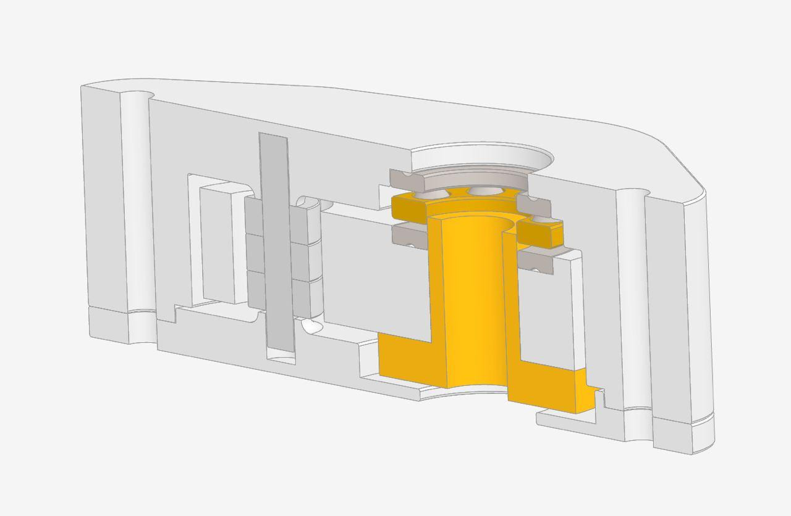
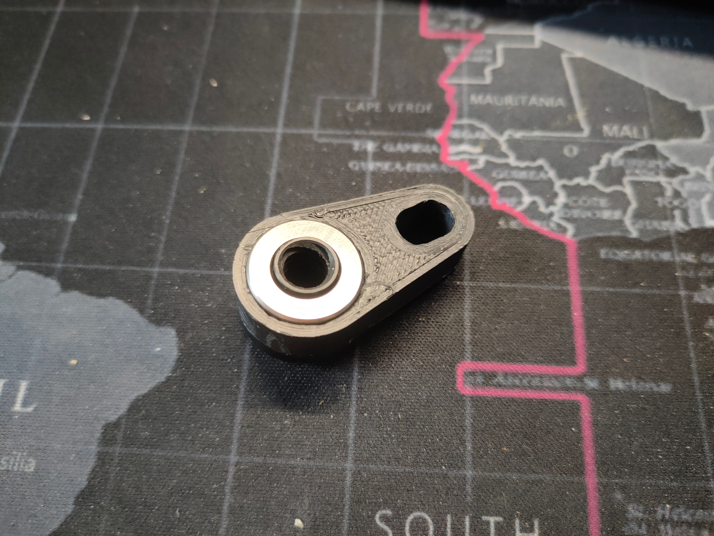
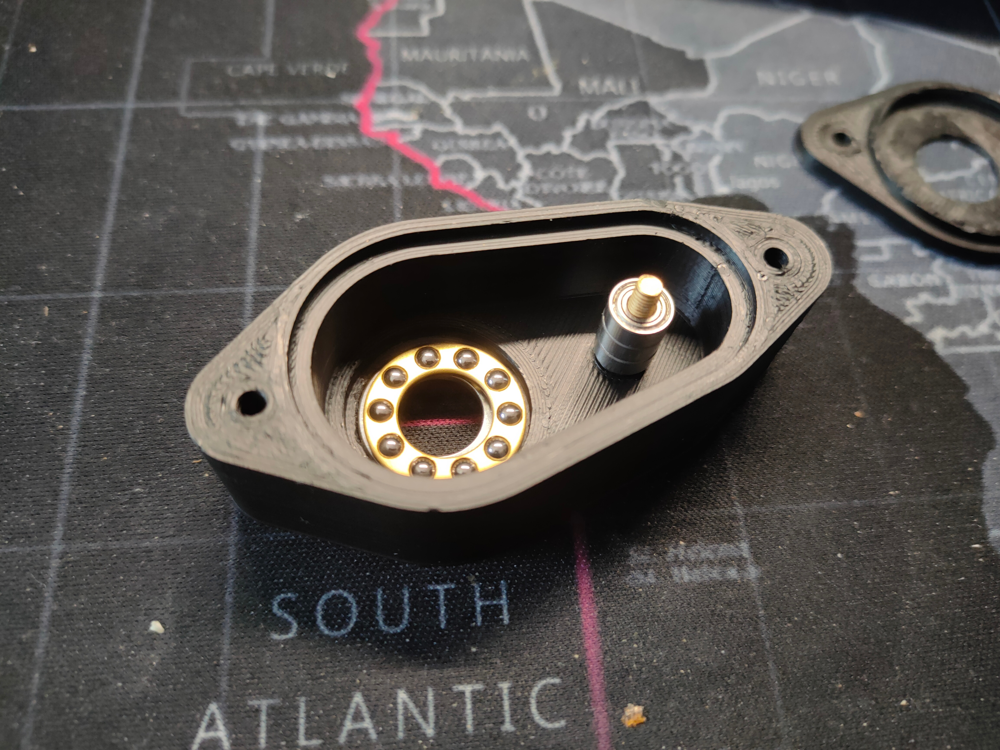
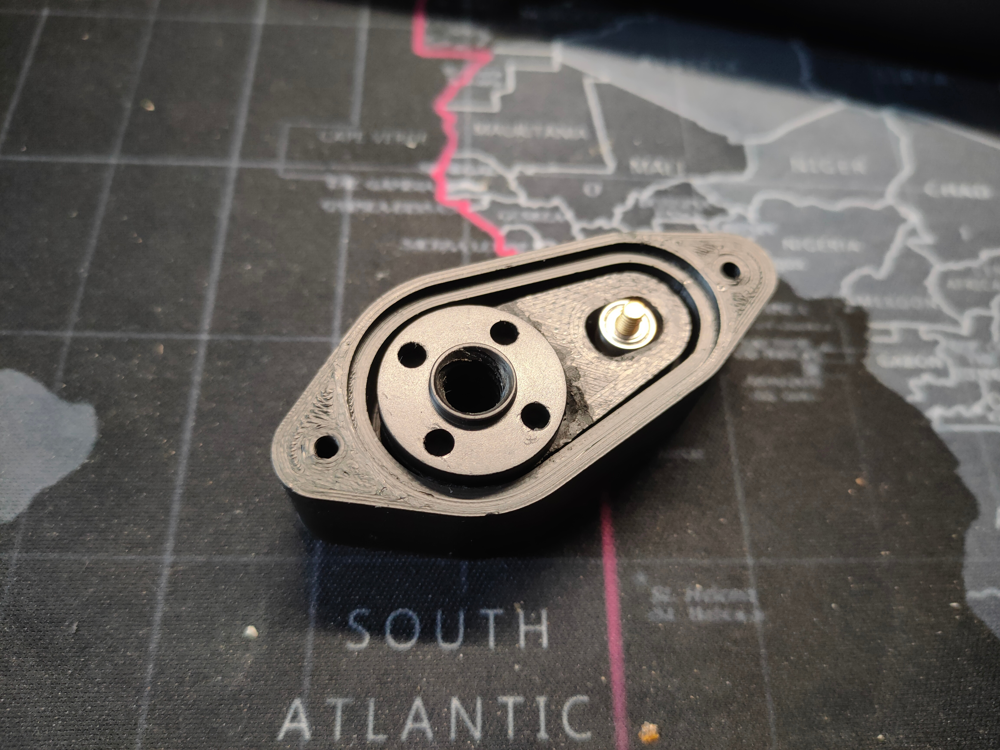
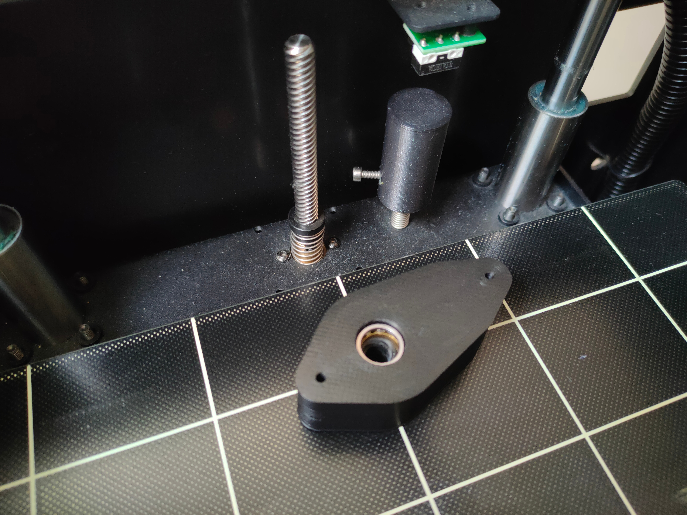
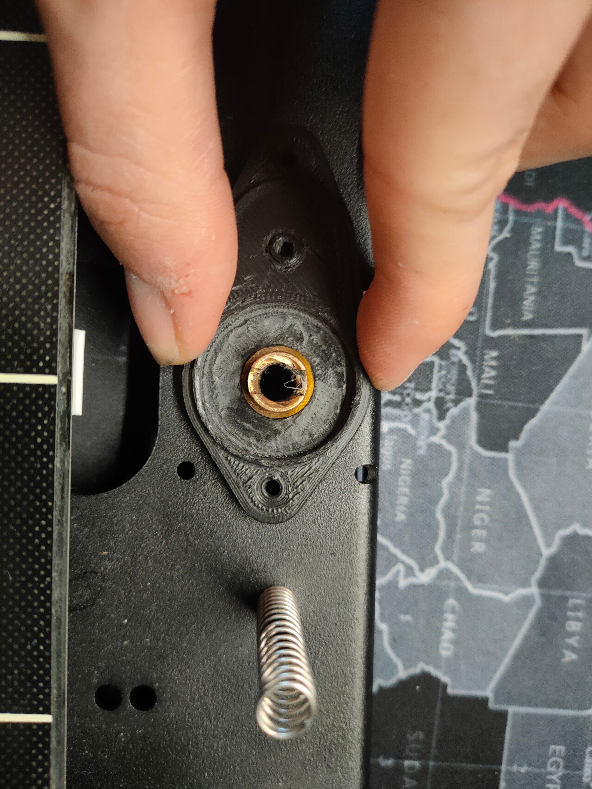
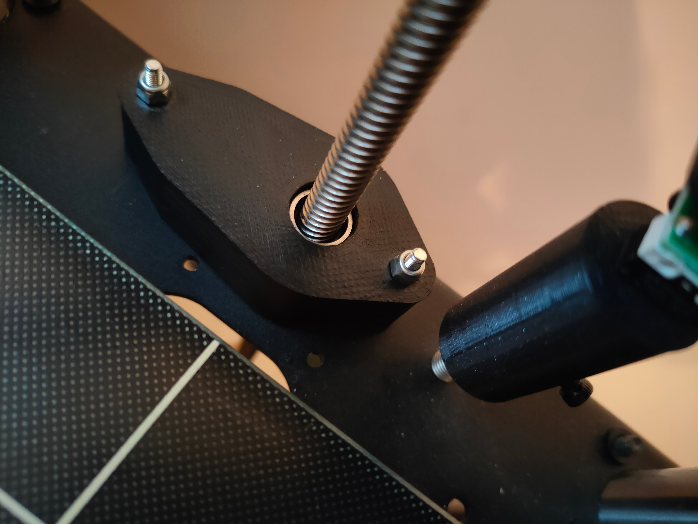
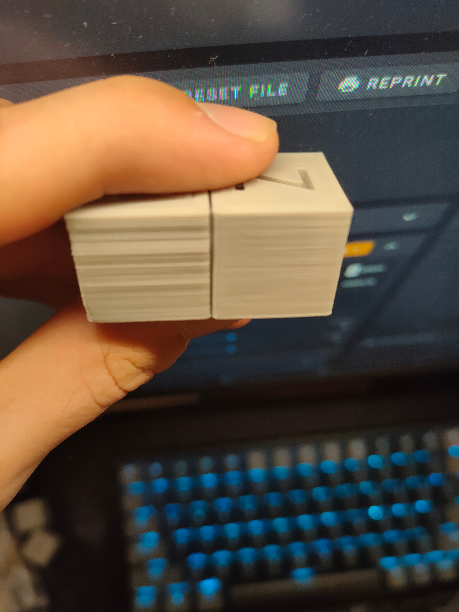

# Dado anti-oscillazione per FBG5

      

## Per che cosa?

Se i tuoi strati sono storti in Z.

      

## Occorrente - Da comprare

1. num 1 [cuscinetto F10-18M](https://aliexpress.ru/item/32911485541.html?spm=a2g0s.9042311.0.0.264d33ed73N87H&_ga=2.71544788.614974143.1618164868-72892778.1612865543&_gac=1.154217162.1618006502.CjwKCAjw9r-DBhBxEiwA9qYUpco5zp6Tzm51R7gYRPCD493Nc5E9YtFcBqfbYOpO6Sfu6D1sGnYDqhoC_oEQAvD_BwE&sku_id=65887171308)
2. num 3 [cuscinetti 683ZZ](https://aliexpress.ru/item/32822303655.html?spm=a2g0s.9042311.0.0.264d33ed73N87H&_ga=2.71544788.614974143.1618164868-72892778.1612865543&_gac=1.154217162.1618006502.CjwKCAjw9r-DBhBxEiwA9qYUpco5zp6Tzm51R7gYRPCD493Nc5E9YtFcBqfbYOpO6Sfu6D1sGnYDqhoC_oEQAvD_BwE&sku_id=66720704030)
3. num 1 [POM 8mm TR 8 x 8](https://aliexpress.ru/item/1005001265317861.html?spm=a2g0s.9042311.0.0.264d33edI79aTn&_ga=2.74754133.614974143.1618164868-72892778.1612865543&_gac=1.121695865.1618006502.CjwKCAjw9r-DBhBxEiwA9qYUpco5zp6Tzm51R7gYRPCD493Nc5E9YtFcBqfbYOpO6Sfu6D1sGnYDqhoC_oEQAvD_BwE)
4. num 1 x M3 bullone ≥ 20 mm (migliore coda di perforazione 3 mm)
5. num 2 bulloni M3 ≥ 30 mm, due dadi

## Occorrente - Da stampare

- Due parti del corpo
- Porta dado

L'occorrente è nella seguente [cartella](stls)

È desiderabile stampare ABS poiché il dado è abbastanza vicino al tavolo.

## Processo di costruzione: 

      
       Sezione per chiarezza 

      
      Passaggio 1, il bullone M3 deve essere tagliato, sporge come guida (preferibilmente la coda del trapano è di 3 mm), prestare attenzione alla rondella del cuscinetto F10-18M, è IN PIEDI

      
      Passaggio 2, prestare attenzione alla rondella del cuscinetto F10-18M, è IN PIEDI

      
        Passaggio 3

      
      Passaggio 4

      
        Passaggio 5

      
           Bene, alla fine, chiudi il coperchio

      
        Il dado deve muoversi liberamente, altrimenti non ha senso 

## Installazione

Per l'installazione, sarà necessario rimuovere completamente il portale XY e rimuovere il piatto, contrassegnare due fori come nella foto, questi sono nuovi fori di montaggio.

      

Foriamo con un trapano da 3 mm per metallo. Praticare un foro alla volta e ricontrollare.

      
Per la verticalità ti chiedo di non battere.

      
       Serriamo tutto con due bulloni e dadi

E mettiamo a posto il tavolo.

## Risultato:

Stampa fotografica prima e dopo (PLA)

      

