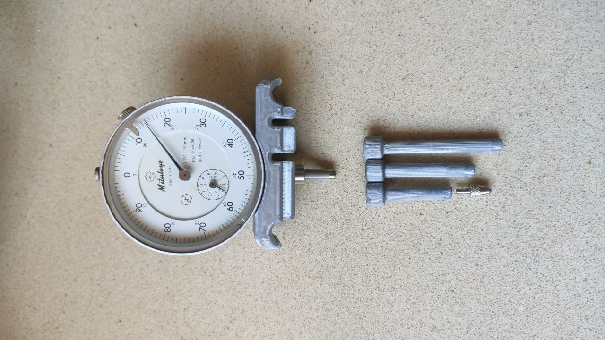
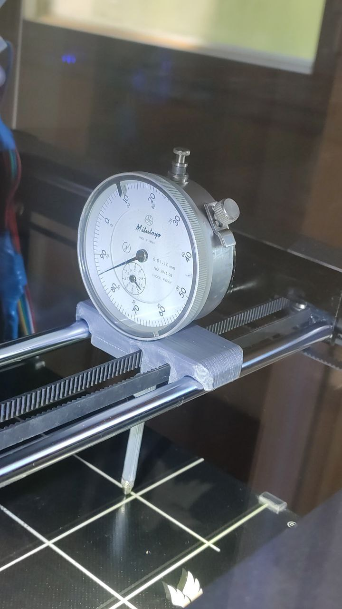

# Manual Bed Leveling

Tale progetto premette un migliore livellamento manuale della nostra Ghost 5 attraverso l'utilizzo di un comparatore centesimale ad orologio.

## Risulatot Finale

  

  

## Link d'acquisto
- [Amazon Spedizione Lenta](https://www.amazon.it/dp/B08GCGK2CP/)
- [Amazon Spedizione Veloce](https://www.amazon.it/dp/B07CRHKDZ9)
- [Aliexpress](https://it.aliexpress.com/item/32955622774.html?albpd=it32955622774&acnt=494-037-6276&aff_platform=aaf&albpg=1301048242692&netw=u&albcp=1691306153&pvid=02240165-383d-4372-8f38-fa53d0d7ac47&sk=UneMJZVf&scm=1007.23534.124736.0&trgt=1301048242692&terminal_id=74a587d1e5444a27972424f123cde8b5&needSmbHouyi=false&albbt=Google_7_shopping&src=google&crea=it32955622774&aff_fcid=640a43145a0c4b6d9415fa4e0c814b74-1622807252469-03723-UneMJZVf&gclid=Cj0KCQjwnueFBhChARIsAPu3YkSQ2g4rzlnOsop_ZBpEwj8pnIqIuo9pQFYzHllxraGi1G9XX2Vv9U4aAumMEALw_wcB&albag=64902423734&aff_fsk=UneMJZVf&albch=shopping&albagn=888888&isSmbAutoCall=false&aff_trace_key=640a43145a0c4b6d9415fa4e0c814b74-1622807252469-03723-UneMJZVf&rmsg=do_not_replacement&device=c&gclsrc=aw.ds)

## Stls
- [Base per Indicatore](Base_for_indicator.STL)
- [Estender 50](Extender_50.STL)
- [Extender 45](Extender_45.STL)
- [Extender 40](Extender_40.STL)
