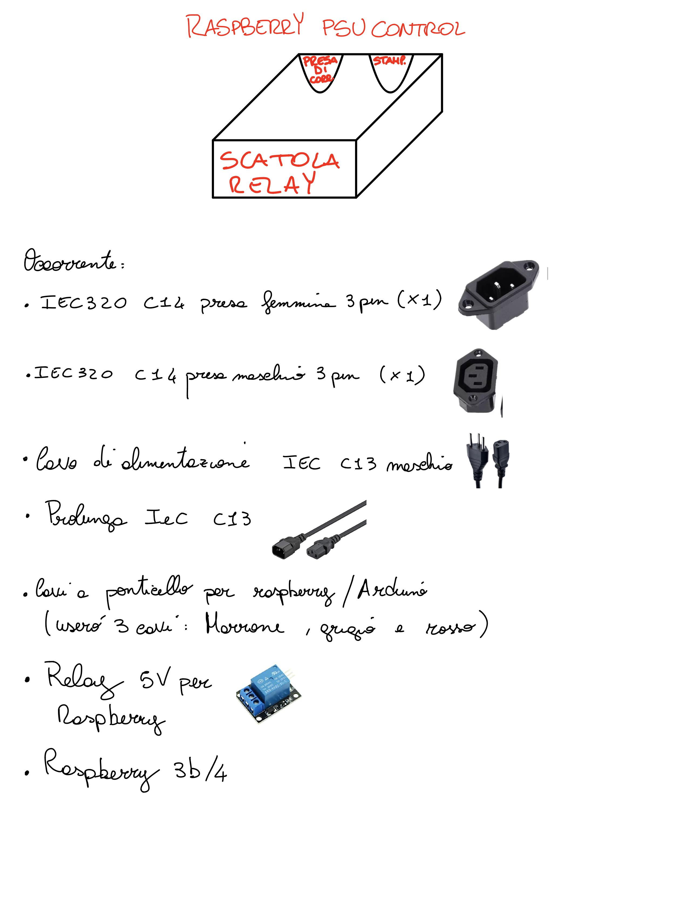
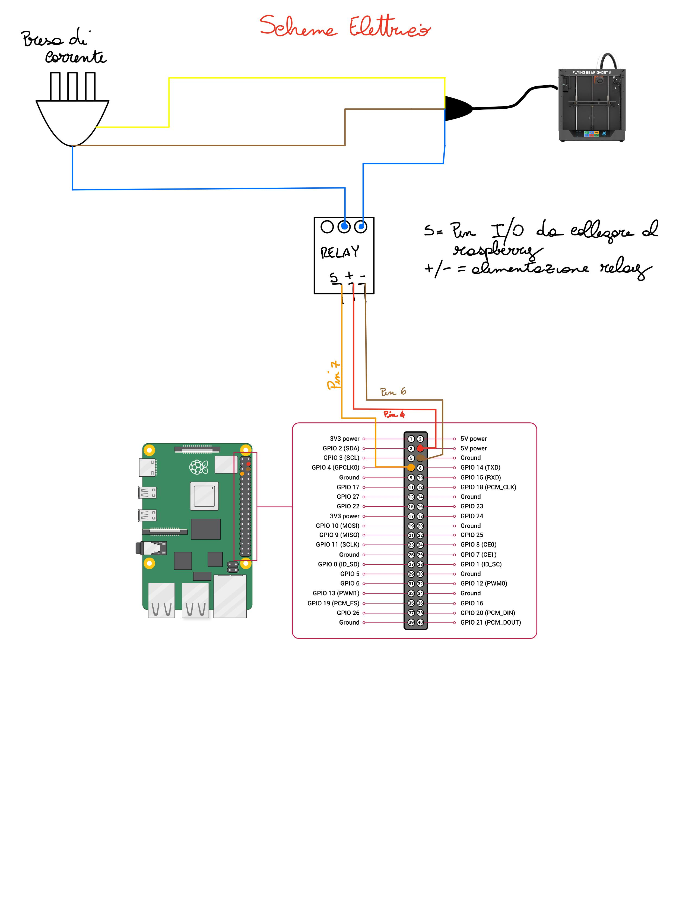
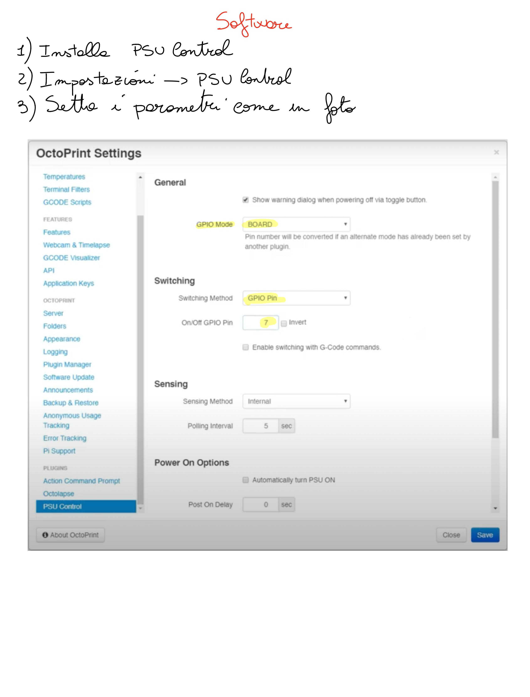

# Octoprint PSU Control

Se desideri controllare lo spegnimento e l'accensione della tua stampante 3D tramite octoprint, questo progetto fa per te.

## Occorrente

- **Raspberry 3b/4**
    - [Aliexpress Link](https://a.aliexpress.com/_m0tWtj5)
    - [Amazon Link](https://www.amazon.it/RASPBERRY-PI-Raspberry-Desktop-Computer/dp/B00LPESRUK/ref=sr_1_1?__mk_it_IT=ÅMÅŽÕÑ&dchild=1&keywords=raspberry+3b+plus&qid=1619095034&sr=8-1)
- **Cavo Alimentazione Stampante**
    - [Aliexpress Link](https://a.aliexpress.com/_mKopqwr)
    - [Amazon Link](https://www.amazon.it/Lindy-30346-Cavo-Alimentazione-Angolo/dp/B0058H0XGQ/ref=sr_1_12?__mk_it_IT=ÅMÅŽÕÑ&dchild=1&keywords=iec+320+c13&qid=1619095365&sr=8-12)
- **IEC 320 Maschio**
    - [Aliexpress Link](https://a.aliexpress.com/_mKz5twx)
    - [Amazon Link](https://www.amazon.it/AERZETIX-connettori-Alimentazione-Computer-Stampante/dp/B07Z3F3WT8/ref=sr_1_26?__mk_it_IT=ÅMÅŽÕÑ&dchild=1&keywords=iec+320+c13+presa&qid=1619095721&sr=8-26)
- **IEC 320 Femmina**
    - [Aliexpress Link](https://a.aliexpress.com/_mLllDhZ)
    - [Amazon Link](https://www.amazon.it/Sourcingmap-terminali-pannello-connettore-alimentazione/dp/B00HUHAB0U/ref=sr_1_4?__mk_it_IT=ÅMÅŽÕÑ&dchild=1&keywords=iec+320+c14&qid=1619095340&sr=8-4)
- **5V Raspberry Relay 1 Canale**
    - [Aliexpress Link](https://it.aliexpress.com/item/33036673478.html?spm=a2g0o.productlist.0.0.35dd104bjpOGRg&algo_pvid=7f0ebc74-9868-4453-9c43-b6c823fcda1a&algo_expid=7f0ebc74-9868-4453-9c43-b6c823fcda1a-0&btsid=0b0a050b16190957745887246edd8d&ws_ab_test=searchweb0_0,searchweb201602_,searchweb201603_)
    - [Amazon Link](https://www.amazon.it/ARCELI-KY-019-Channel-Module-arduino/dp/B07BVXT1ZK/ref=sr_1_8?__mk_it_IT=ÅMÅŽÕÑ&dchild=1&keywords=raspberry+5v+relay&qid=1619095807&sr=8-8)
- **Cavi a ponticello per Arduino/Raspberry**
    - [Aliexpress Link](https://it.aliexpress.com/item/1005002000655439.html?spm=a2g0o.productlist.0.0.691d1820eawxtv&algo_pvid=null&algo_expid=null&btsid=0b0a050b16190958305797699edd8d&ws_ab_test=searchweb0_0,searchweb201602_,searchweb201603_)
    - [Amazon Link](https://www.amazon.it/AZDelivery-Cavetti-Maschio-Femmina-Raspberry/dp/B074P726ZR/ref=sr_1_3_sspa?__mk_it_IT=ÅMÅŽÕÑ&dchild=1&keywords=cavi+arduino&qid=1619095849&sr=8-3-spons&psc=1&smid=A1X7QLRQH87QA3&spLa=ZW5jcnlwdGVkUXVhbGlmaWVyPUExOTNVSlBIUDBOM0c2JmVuY3J5cHRlZElkPUEwMDg2ODU5M1FURTdCQTM3S043RCZlbmNyeXB0ZWRBZElkPUEwMjkxNjQ4MzQ0TFpMOFhLRFNZMyZ3aWRnZXROYW1lPXNwX2F0ZiZhY3Rpb249Y2xpY2tSZWRpcmVjdCZkb05vdExvZ0NsaWNrPXRydWU=)
- **IEC 320 Prolunga**
    - [Aliexpress Link](https://a.aliexpress.com/_mMmK1I7) 
    - [Amazon Link](https://www.amazon.it/dp/B004787EU0/ref=cm_sw_r_cp_api_glt_i_64ATZ65C4ZHDVQ1WMWEJ)
- **Ventola Raspberry 3cm** (Opzionale)
    - [Aliexpress Link](https://it.aliexpress.com/item/32961250837.html?spm=a2g0o.productlist.0.0.409c2adbwoqmQ0&algo_pvid=f0a3da51-af88-4e1b-9441-d774b199f881&algo_expid=f0a3da51-af88-4e1b-9441-d774b199f881-6&btsid=2100bdde16190961477043966ec077&ws_ab_test=searchweb0_0,searchweb201602_,searchweb201603_)
    - [Amazon Link](https://www.amazon.it/MakerHawk-Raspberry-Brushless-Connector-Separating/dp/B071JN6HKM/ref=sr_1_2?__mk_it_IT=ÅMÅŽÕÑ&dchild=1&keywords=raspberry+3mm+ventola&qid=1619096033&sr=8-2)

## Struttura (STL)

- [Scatola](Octoprint_box_bottom.stl)
- [Copertura Scatola](stls/Octoprint_box_upper.stl)

## Guida Completa

  

  

  

