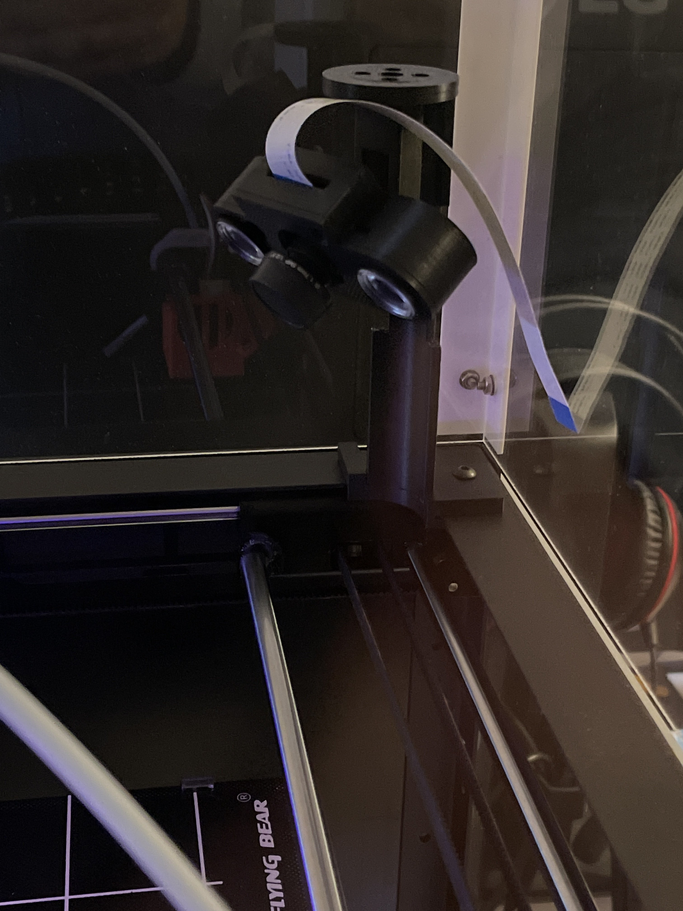
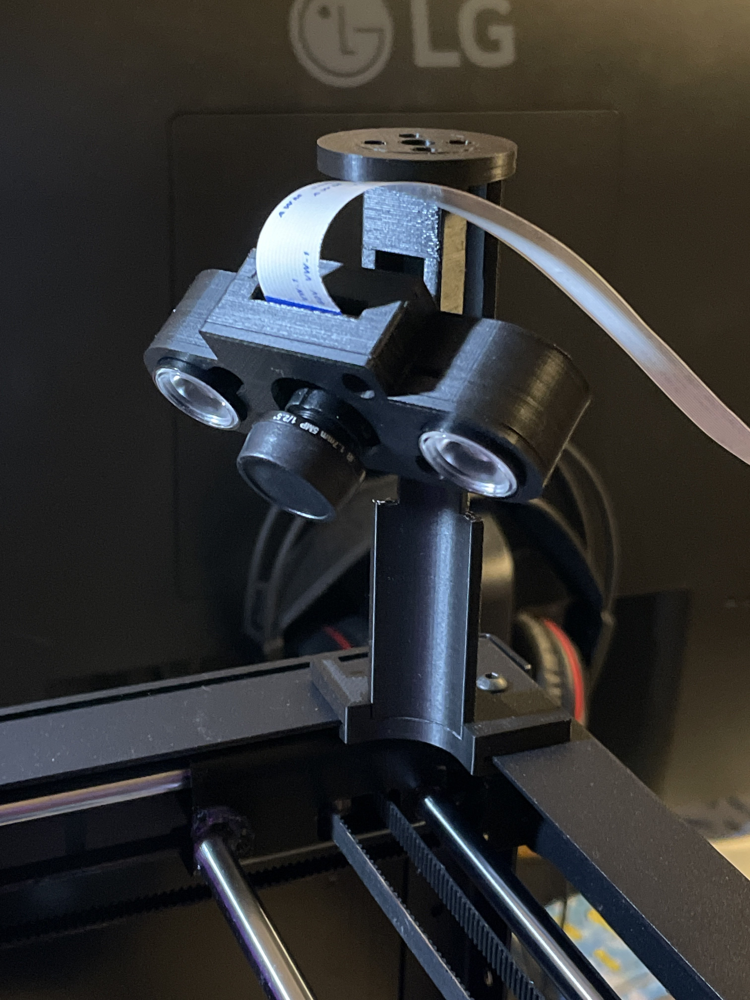
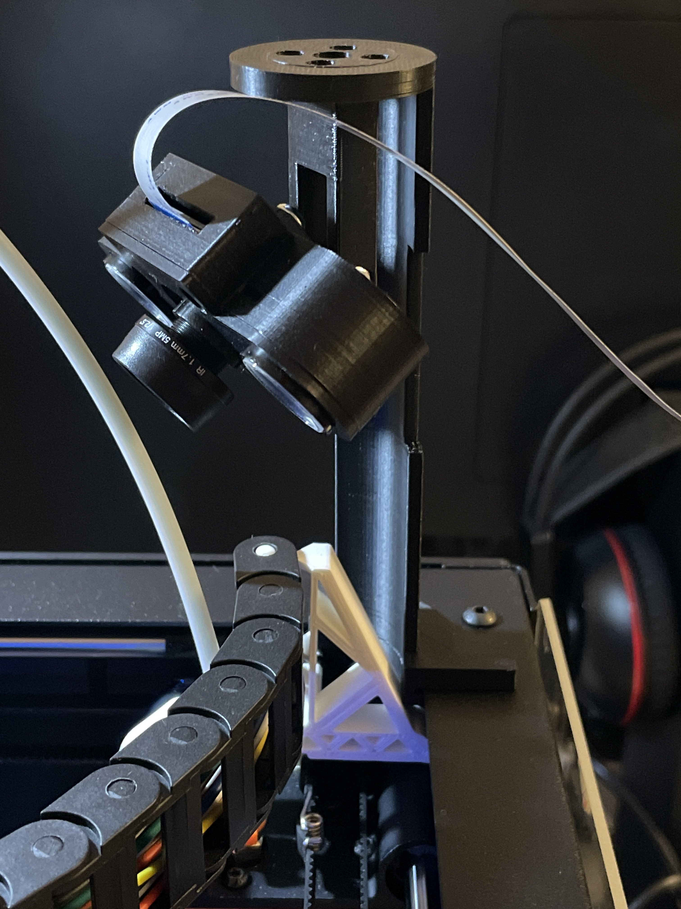

# Raspberry Infrared Camera Mount For Flyingbear Ghost 5

## Risultato Finale

  

  

  

## Stl Files

- [Staffa Snodo.stl](stls/Staffa_Snodo.stl)
- [Braccio Snodo.stl](stls/braccio_snodo.stl)
- [Base Cover.stl](stls/base_cover.stl)
- [Coperchio](stls/coperchio.stl)
- [Base Supporto Angolo](stls/base_supporto_angolo.stl)
- [Staffa Supporto Angolo](stls/staffa_supporto_angolo.stl)