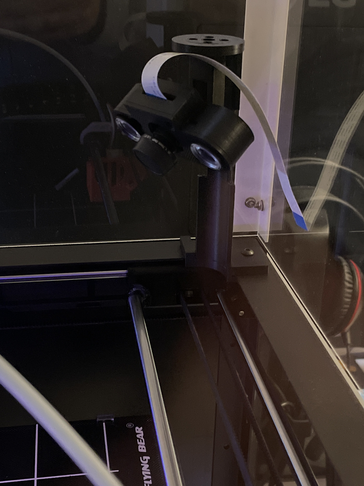
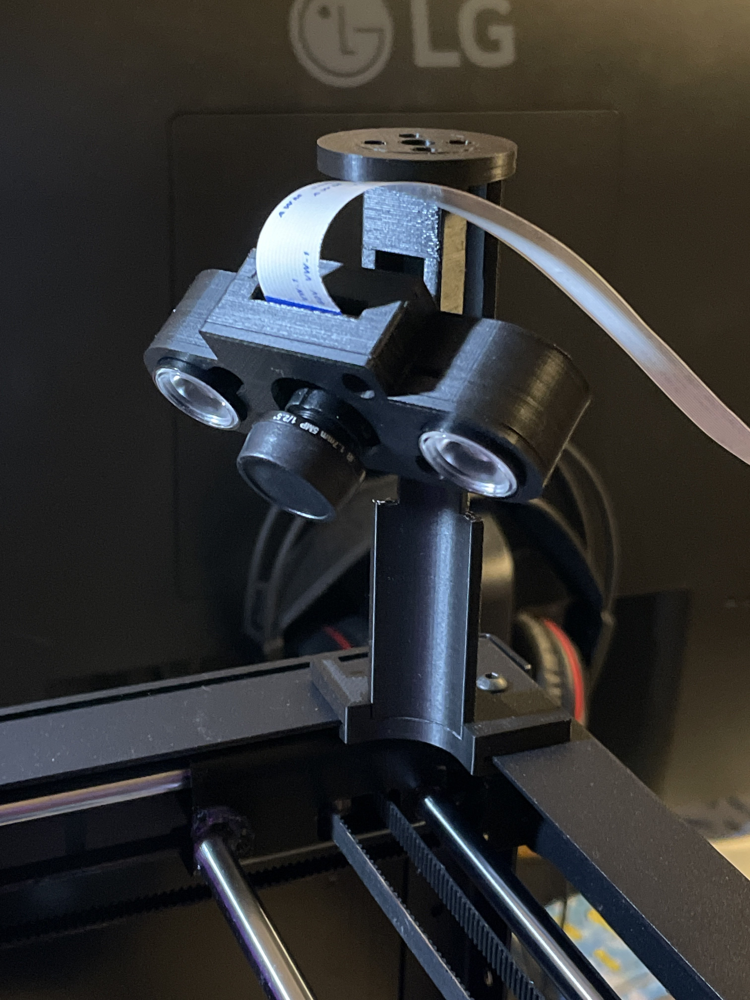
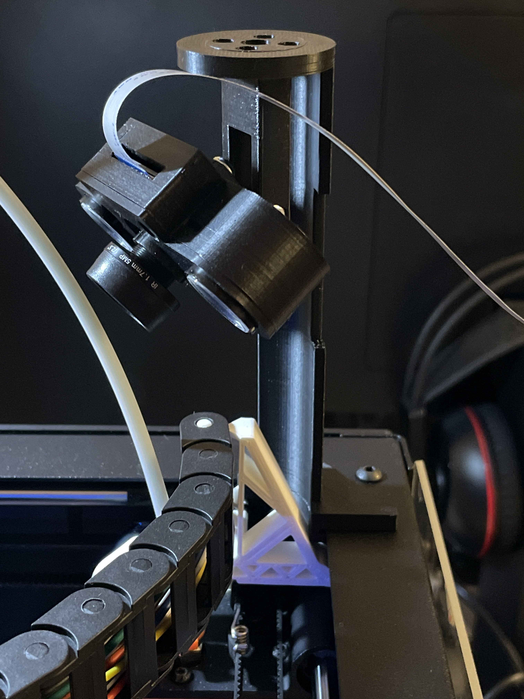
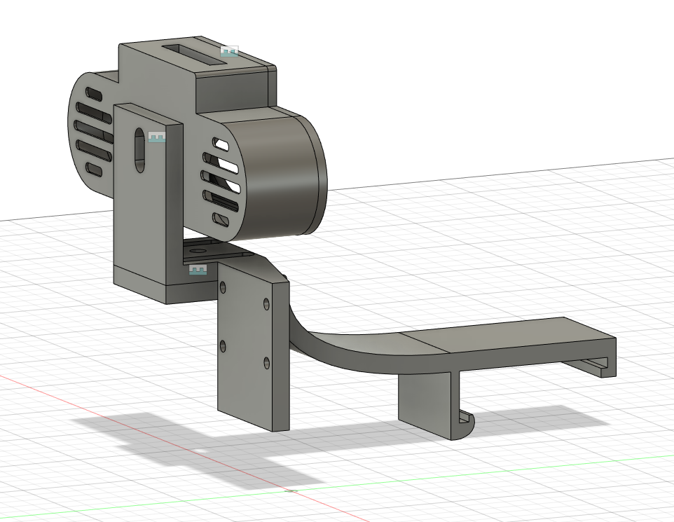
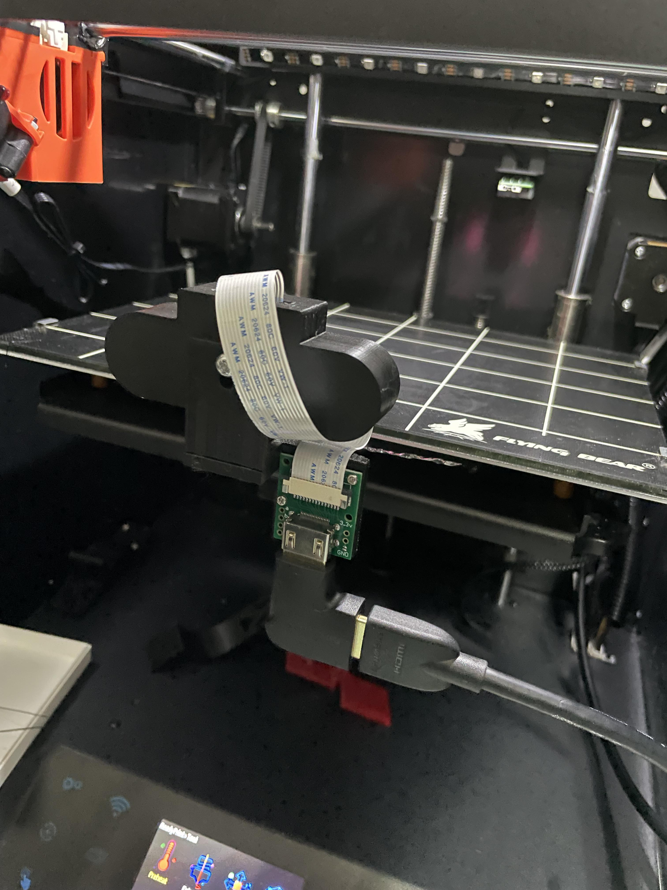
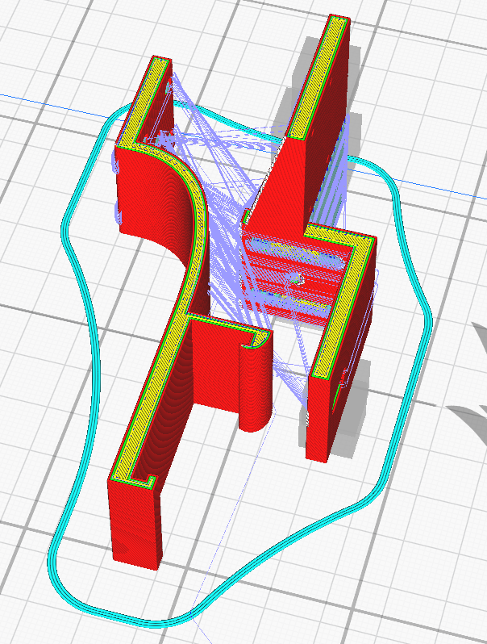
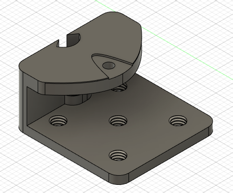
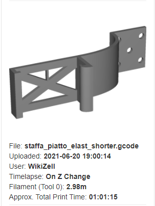
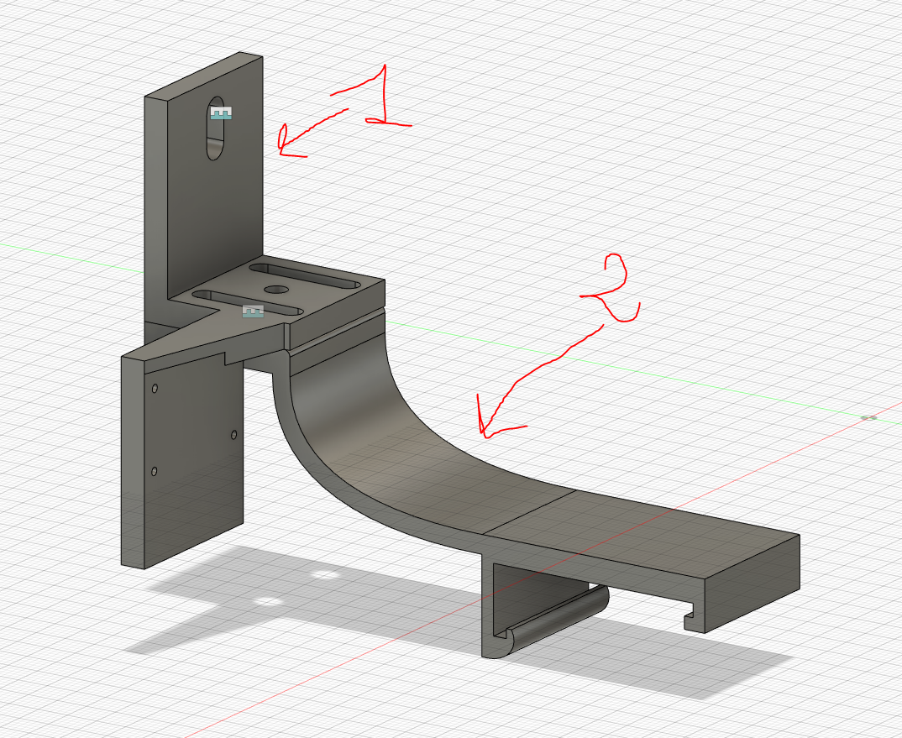

# Raspberry Infrared Camera Mount For Flyingbear Ghost 5

## Risultato Finale (Montaggio Alto)

  

  

  

## Stl Files (Montaggio Alto)

- [Staffa Snodo.stl](stls/high_mount/Staffa_Snodo.stl)
- [Braccio Snodo.stl](stls/high_mount/braccio_snodo.stl)
- [Base Cover.stl](stls/high_mount/base_cover.stl)
- [Coperchio](stls/high_mount/coperchio.stl)
- [Base Supporto Angolo](stls/high_mount/base_supporto_angolo.stl)
- [Staffa Supporto Angolo](stls/high_mount/staffa_supporto_angolo.stl)

## Risultato Finale (Montaggio Piatto)

  

  

  

  

  
  

  

  

## Stl Files (Montaggio Piatto)

- [Supporto Piatto](stls/bed_mount/bed_braket.stl)
- [Adattatore Supporto](stls/bed_mount/adapter_bracket.stl)
- [Adattatore Supporto NO HDMI](stls/bed_mount/adapter_bracket_NO_HDMI.stl)
