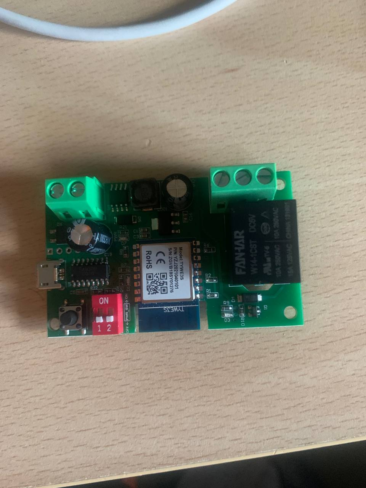
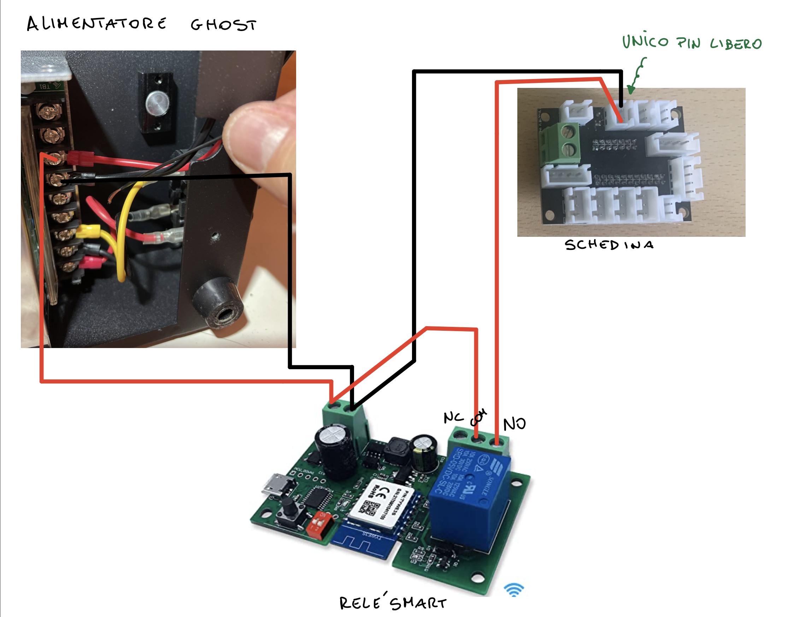
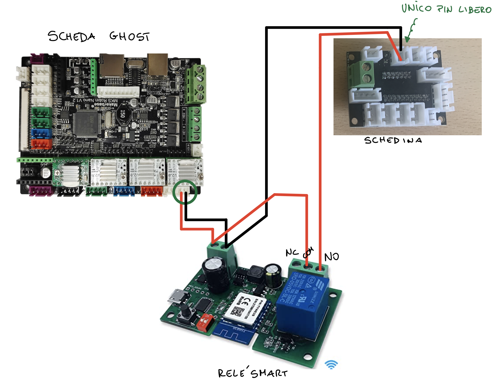
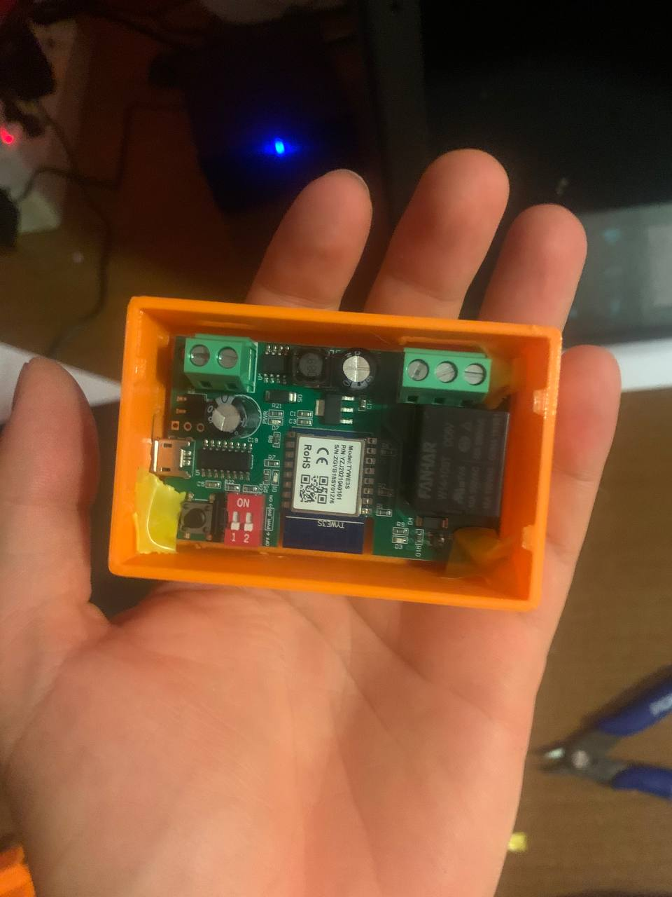
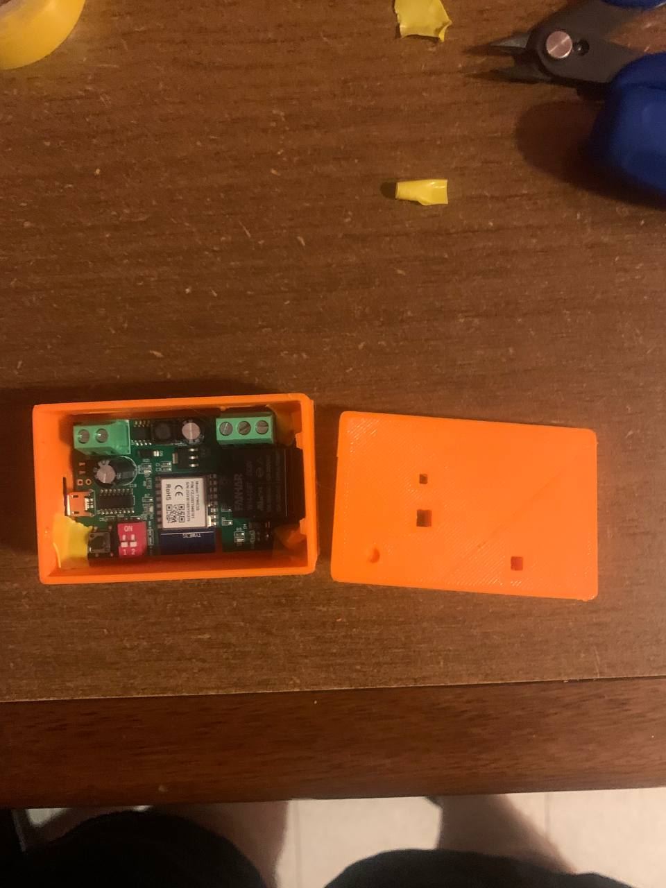
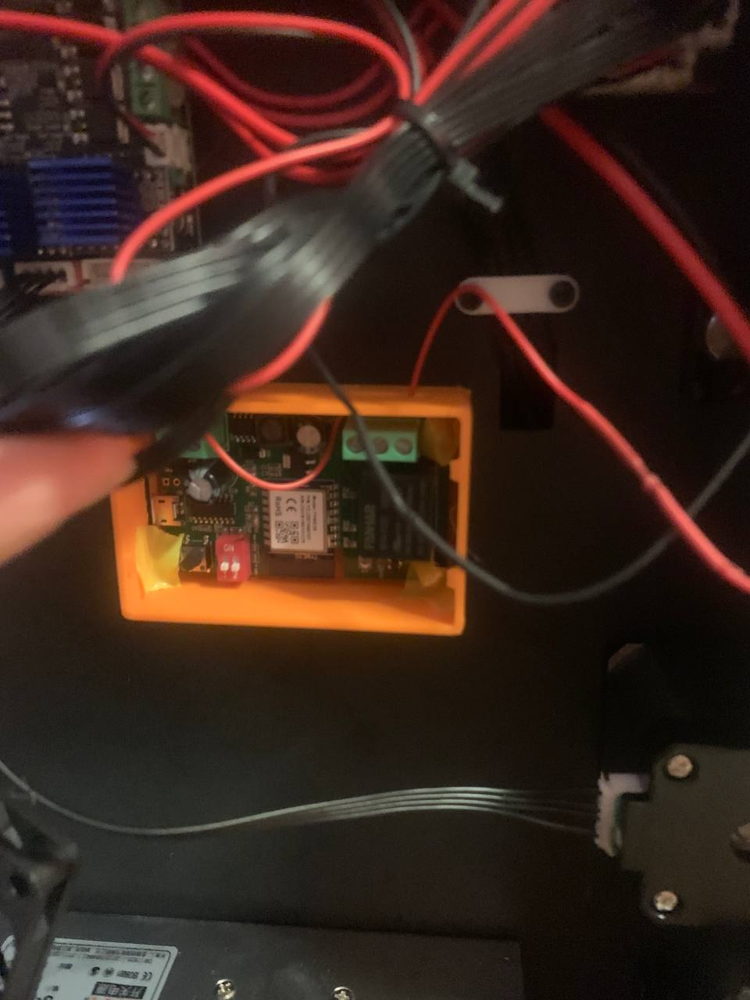
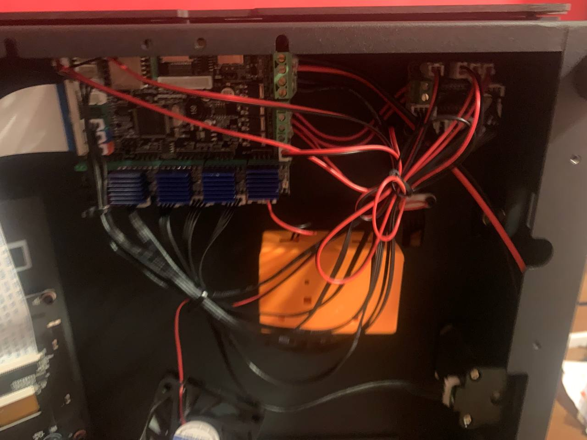
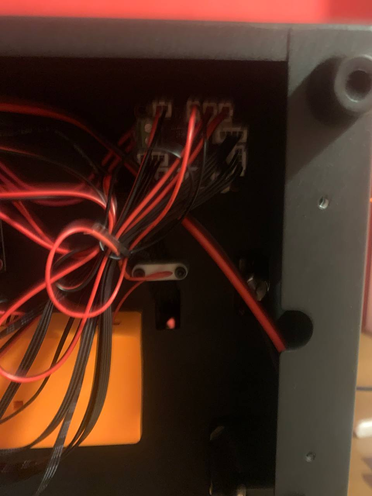

# Ikea Dioder - Versione Smart

Questo progetto è nato per poter alimentare direttamente, tramite il pin vuoto della stampante, delle semplici strisce LED (non smart) rendendole smart attraverso un relè.

Consiglio: Dato che il relè in questione può anche essere alimentato via usb vi consiglio di configurarlo con la sua app nativa (SmartLife) prima di effettuare il cablaggio tramite stampante in modo tale che una volta effettuato il collegamento dei cavi elettrici il tutto sia già configurato e pronto all'uso.

## Occorrente

- [Ikea Dioder](https://www.ikea.com/us/en/p/dioder-led-4-piece-light-strip-set-white-20119418/) o qualsiasi altra striscia led 
- [Relé SmartLife](https://www.amazon.it/gp/product/B07SNBKXH5/ref=ppx_yo_dt_b_asin_title_o00_s00?ie=UTF8&psc=1) o qualsiasi altro relè smart
- Cavi connettore JST XH2.54 2 pin:
    - [Link Aliexpress](https://it.aliexpress.com/item/32954418743.html?spm=a2g0s.9042311.0.0.27424c4djxtsz4)
    - [Link Amazon](https://www.amazon.it/Connettore-Connettori-Espansione-Intestazione-XH2-54-2P/dp/B08P3JN1MQ/ref=sr_1_1?__mk_it_IT=ÅMÅŽÕÑ&dchild=1&keywords=JST+XH2.54&qid=1630515821&sr=8-1)
- Comune nastro isolante

## Schema Cablaggio

Per cablare il tutto puoi scegliere se alimentare il relè e i led ad esso collegati connettendo il relè direttamente ad un pin della scheda madre oppure se alimentarlo tramite alimentatore della stampante. Di seguito verranno mostrate le due modalità di montaggio:

### Collegamento tramite alimentatore

### Collegamento tramite pin della scheda madre

## Risultato Finale

