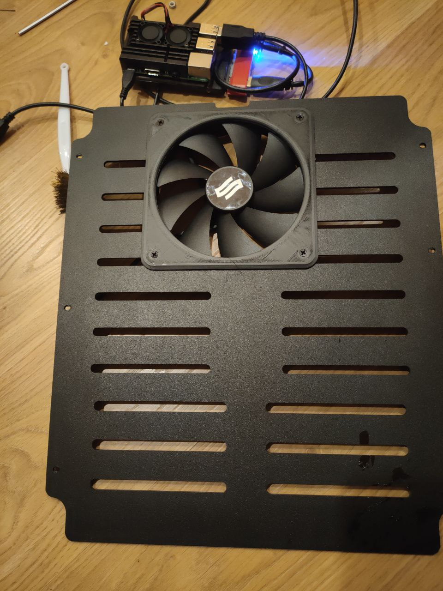
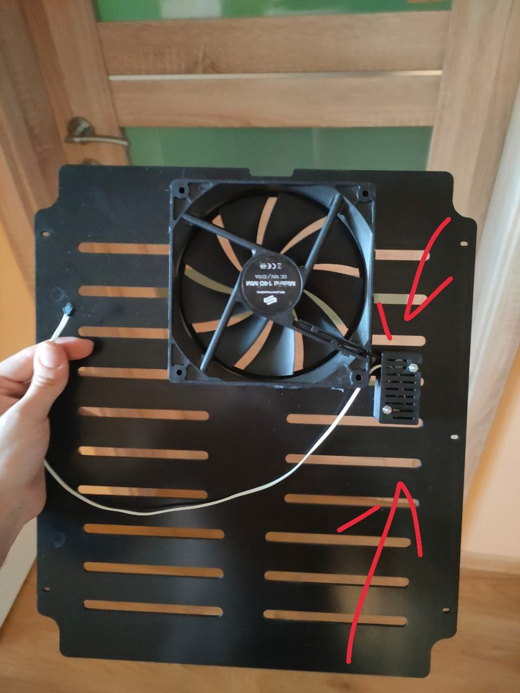
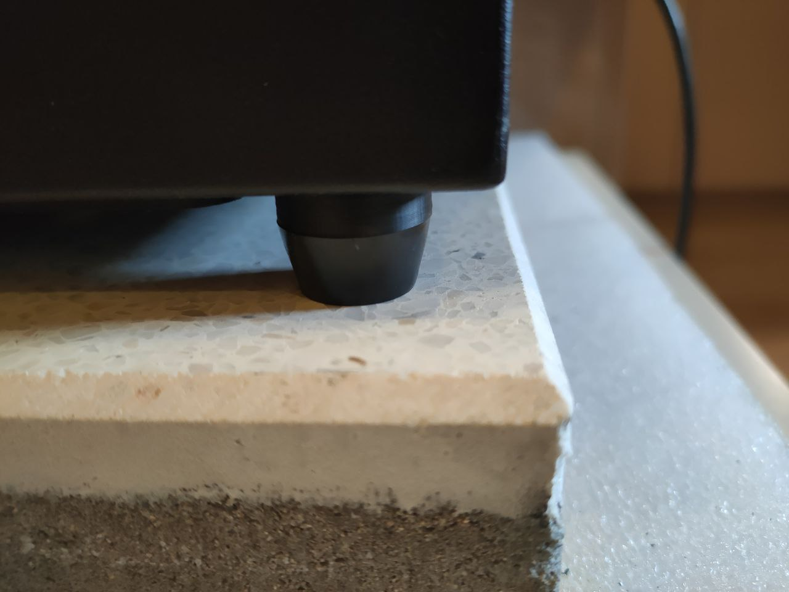
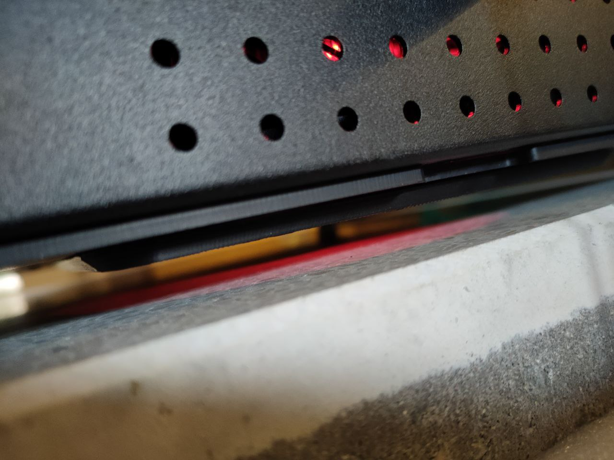

# Ventola Maggiorata 

Se anche voi avete bisogno di un maggiore flusso d'aria per la ghost o solamente per sostituire la ventola stock rumorosa con una più grande vi basterà seguire questa semplice guida.

## Risultato Finale

 

  

  

  
 **Rialzo per Piedini**
  

  

  

  
  

## Files Stl

- [Case ventola](stls/danduck.stl)
- [Rialzo Piedini](stls/legs.stl)
- [Case Buck Converter bottomo](stls/module_case_bottom.stl)
- [Case Buck Converter Top](stls/module_case_top.stl)

## Occorrente

- [Buck Converter](https://a.aliexpress.com/_uXTZmX): Serve a convertire i 24v della ghost in 12v o 5v
- Qualsiasi ventola da 140mm, per esempio una [Noctua](https://www.amazon.it/Noctua-NF-A14-ULN-Ventola-140/dp/B00AA89BN4/ref=sr_1_2_sspa?__mk_it_IT=ÅMÅŽÕÑ&dchild=1&keywords=140mm+ventola+silenziosa&qid=1620474844&sr=8-2-spons&psc=1&smid=A38F5RZ72I2JQ&spLa=ZW5jcnlwdGVkUXVhbGlmaWVyPUEzVjJaRFhQQUFTM1JYJmVuY3J5cHRlZElkPUEwMDM5MDMyMTIySzI5SDRFU0kwSiZlbmNyeXB0ZWRBZElkPUEwODQ3MTM1T0tTV0xWODJYQ0tUJndpZGdldE5hbWU9c3BfYXRmJmFjdGlvbj1jbGlja1JlZGlyZWN0JmRvTm90TG9nQ2xpY2s9dHJ1ZQ==)

