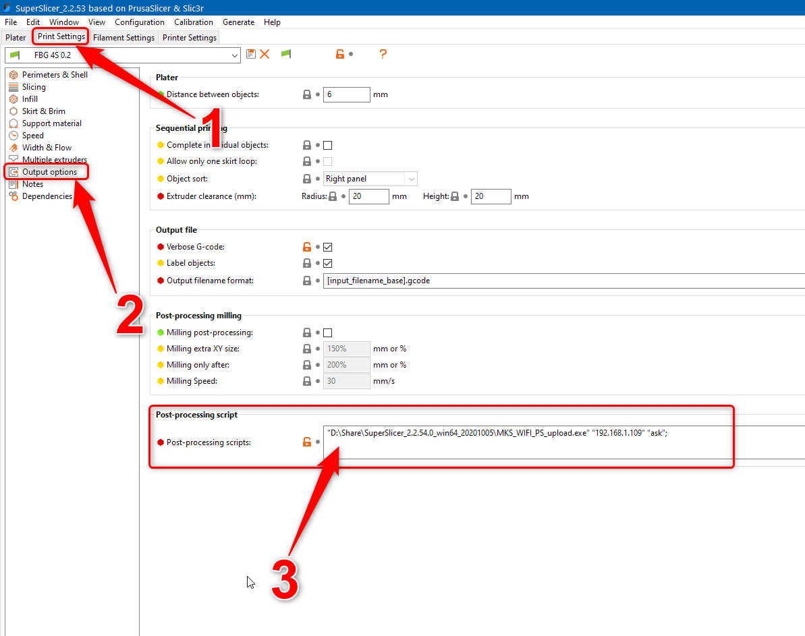

# MKS-WIFI Uploader for Prusa Slicer (and forks)

Questo semplice strumento consente di caricare file e avviare lavori di stampa per stampanti dotate di modulo Makerbase MKS-WIFI (ad esempio Flyingbear Ghost 4S / 5)


### Versioni
È scritto su Python e disponibile in 2 versioni:
+ Script Python (richiede Python 3 con ** richieste ** pacchetto)
+ Eseguibile Windows x64 (congelato con pyinstaller, più comodo, nessun requisito per l'esecuzione)

Potrei pensare di rilasciare eseguibili aggiuntivi (come Win32 o linux) se ce ne sarà una reale richiesta. Fino ad allora potresti sempre usare la versione dello script Python (o impacchettare l'eseguibile tu stesso usando ad esempio pyinstaller)

### Utilizzo

Originariamente doveva funzionare come script di post-elaborazione in Prusa Slicer (o è fork come Slic3r ++ / SuperSlicer)
Scarica lo script o l'eseguibile nella posizione che preferisci (non necessariamente la directory di installazione del tuo slicer). Tuttavia, evita di utilizzare directory di sistema come Programmi su Windows, altrimenti il tuo filtro dei dati potrebbe richiedere diritti elevati per eseguire lo script.
Per utilizzare Uploader seleziona il tuo profilo di stampa e vai alle opzioni di output. Qui inserisci il seguente comando nello script di post-elaborazione

##### Per utilizzare l'eseguibile (see screenshot)
```
"\path\to\the\executable\MKS_WIFI_PS_upload.exe" ip_address mode;
```

##### Per utilizzare lo script Python
```
"\path\to\the\python\installation\pythonw.exe" "\path\to\the\script\MKS_WIFI_PS_upload.pyw" ip_address mode;
```

##### Simplify3D
È possibile utilizzare lo script con Simplify3D slicer (tuttavia, non funziona se il percorso del file g-code contiene spazi). Aggiungi il seguente comando alla sezione "Ulteriori comandi da terminale per la post-elaborazione" nella scheda "Script" (sono necessarie virgolette e parentesi!)
```
"\path\to\the\executable\MKS_WIFI_PS_upload.exe" ip_address mode [output_filepath]
```
Per ulteriori informazioni: [Simplify3D forums](https://forum.simplify3d.com/viewtopic.php?f=8&t=1959)

##### ip_address - indirizzo IP della stampante nella rete locale

##### mode - una delle seguenti opzioni:
+ **ask** - quando viene caricato un file, lo script chiederà se si desidera iniziare immediatamente a stamparlo
+ **always** - quando un file viene caricato, lo script inizierà immediatamente a stamparlo senza chiedere
+ **never** - quando viene caricato un file lo script non avvierà nessun lavoro di stampa e non chiederà nulla

In realtà devi apportare questa modifica a ogni profilo di stampa per cui desideri utilizzare Uploader.
Dopodiché, ogni volta che salvi un file g-code (in qualsiasi posizione, non necessariamente nella stessa directory con lo script), questo file verrà caricato sulla tua stampante.

### Standalone mode
Nonostante sia inteso come uno script di post-elaborazione, Uploader può essere utilizzato in modo completamente autonomo.
Se viene eseguito senza alcuna opzione (ad esempio, fare doppio clic sull'eseguibile) prima ti chiederà di selezionare un file che desideri caricare e chiederà l'indirizzo IP della tua stampante. Procede quindi con il caricamento del file e chiede se si desidera stamparlo (simile all'esecuzione in modalità ** ask **)

In alternativa puoi eseguirlo da una riga di comando fornendo il percorso del tuo file gcode come terza opzione:
```
MKS_WIFI_PS_upload.exe ip_addr mode "\path\to\the\file\for\upload.gcode"
```
